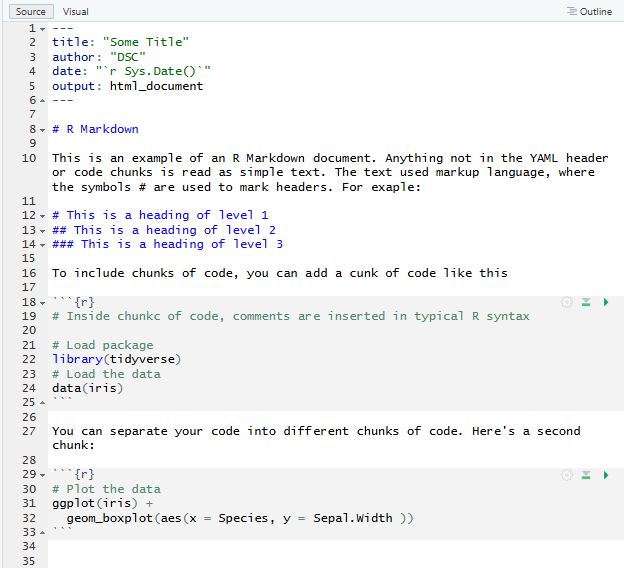
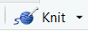

# Generate Reports With R Markdown

If you haven’t done so already, please install R Markdown and LaTeX on your computer. For instructions, go back to the [Pre-Workshop Activities](pre-workshop.html) page.

## What is R Markdown?

R Markdown is a text language that can be used to combine code, code outputs (i.e. figures, tables, etc) and comments into a single document. The file extension of R Markdown documents is .Rmd. R Markdown is in itself a modification of the Markdown language (files .md), which is a type of [markup language](https://en.wikipedia.org/wiki/Markup_language){:target="_blank"}. Markup languages are text languages that allow to combine content such as text and figures, as well as creating relationships between different parts (such as headers and links). Although this might seem complicated, R Markdown is easy to learn and, when used within RStudio, it makes it very easy to integrate multiple parts of your workflow (coding, seeing results, interpreating results, etc) into a single, feature-rich document. R Markdown also facilitates reproducible research by making your methods (i.e. your code), results and inferences transparent. 

## How does R Markdown work?

The .Rmd files are plain text files. They contain three types of content:
- A section with metadata about the document (i.e. author, title, date, output format, etc), in what is called a YAML header. They are separated by the rest of the document by `---`s.
- Chunks of code where the actual R code is written. The start of an R chunk is marked by ````{r}`, and the end is marked by `````.
- Text using simple text formatting. Everything not between the YAML and code chunk marks is read as simple text.

See the example markdown file below and try to identify the three types of content:


When using an R Markdown file in RStudio, it automatically generates an interface where you can run each chunk of code independently and see the results in the console or inline after the chunk of code (this is called an [R Notebook](https://bookdown.org/yihui/rmarkdown/notebook.html){:target="_blank"}). This is already a super helpful feature to organize your code. However, R Markdown is also powerful because you can generate reports in multiple formats such as .html, .docx, and .pdf.

To generate a report from an .Rmd document, you can use the command line `render()` function, or you can just click the Knit button. This will start a several-step process (more info [here](https://rmarkdown.rstudio.com/lesson-2.html){:target="_blank"}) which will end with the document in the format you specified. 

### Code Chunks

When an .Rmd file is knitted/rendered, R Markdown will simply run each code chunk and print the code followed by the output of the code. However, you can customize this by turning each one of those steps on or off (i.e., run the code, print the code, print the code output). For example, if you are adding a plot to a text, you might want R Markdown to run the code, but print only the output (i.e. the figure) and not the actual code. These additional arguments are specified inside the `{}` of the code chunk header. You can find more information [here](https://rmarkdown.rstudio.com/lesson-3.html){:target="_blank"}. 

### Simple text

The simple text in .Rmd files should be formatted using the [Markdown language](https://www.markdownguide.org/basic-syntax/){:target="_blank"}. This is a simple syntax to format your text. For example, Markdown uses # for headers, * for italics and ** for bold. So writing `*this*` would result in *this*, and writing `**this**` would result in **this**. For a more complete list of Markdown syntax, see [this link](https://rstudio.github.io/cheatsheets/html/rmarkdown.html#write-with-markdown){:target="_blank"}.
  
## Creating an R Markdown document

For the rest of the workshop, we will save our code in an R Markdown file. Let's create this file in RStudio. The steps are similar to those described in the cheatsheet.
-   Open RStudio, click **File -> New File -> RMarkdown...**
-   Enter title, author, and select the type of output format **PDF** and click **OK*
-   The Markdown document with some example code will appear in your Editor window.
    

-   After creating your R Markdown file, you must save it. Click **File -> Save As ->...** Enter the filename and make sure to remember where you saved it.

    

## Knitting an R Markdown document

-   Click the **Knit** icon in the toolbar (see image of the icon on the right to know what to look for). A PDF file is now generated and saved to folder/directory where you saved your .Rmd file.
-   Open the newly created .pdf file and compare it to the .Rmd file to see how the content is knitted to .pdf.
-   Continue editing this R Markdown document for other Activities.

## More information on R Markdown

Good introductory references to R Markdown to help as you navigate learning this new tool are:
- [Get Started with R Markdown](https://rmarkdown.rstudio.com/lesson-1.html){:target="_blank"}
- [RMarkdown Cheat Sheet](https://rstudio.github.io/cheatsheets/html/rmarkdown.html){:target="_blank"}

[NEXT STEP: Tests For Difference in Means (t-tests, ANOVA)](act-2.html){: .btn .btn-blue }
