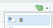

```{r setup, include=FALSE}
# This code block is to the benefit of anyone working with the .Rmd file to edit the workshop material, rather than participating in the workshop. Hence, it should always be setup to include = FALSE, so it does not appear in the knitted .md file 

# Make echo = TRUE the default option
knitr::opts_chunk$set(echo = TRUE)

# Uncomment the install.packages if you haven't installed and loaded the 'readxl' package
#install.packages("readxl")
library(readxl)

# Function that will generate the .md text that creates the toggle button to show answers for activities. To use this function, you should use it inside an code chunk set with echo = FALSE (meaning, do not show) and results = "asis", meaning print the results not in a output chunk. Check the document below for an example
startCodeDetailsBlock <- function(summaryText = "Check Your Code") {
  # Use cat to directly output the string without quotes and avoid unintended newlines
  cat(
    "{::options parse_block_html=&apos;true&apos; /}<details><summary markdown='span'>", summaryText, "</summary>"
  )
}

# Function that will generate the .md text that ends the toggle button to show answers for activities. Same usage applied as explained for function above.
endCodeDetailsBlock <- function() {
  cat("</details>{::options parse_block_html=&apos;false&apos;/}")
}
```

# Test for Difference in Means (t-tests, ANOVA)

Tips before you start:

-   You can pull up documentation for a function by executing `?function_name` (e.g. `?t.test`) in the Console.

-   Also, a quick note...

::: {.task-box markdown="1"}
<u><b>A quick note about using AI</b></u>

As you work through this workshop, you may feel tempted to ask an AI model for help with the exercises. We discourage this because delegating something to AI can prevent you from developing that skill. In fact, one of the most effective ways to learn R is to troubleshoot code by yourself. AI models can also hallucinate and produce incorrect code, so you need to understand enough about R to be able to evaluate their output. If AI is doing all your coding for you and you don't learn the underlying logic and syntax of R, it will be harder for you to verify their output. That being said, AI can definitely be a helpful tool, especially if you use with the right attitude and know what and how to ask for the most useful responses. While this workshop doesn’t cover best practices for using AI in coding, you can find some useful tips <a href="https://journals.plos.org/ploscompbiol/article?id=10.1371/journal.pcbi.1011319" target="_blank" rel="noopener noreferrer">here</a> and <a href="https://tidyverse.org/blog/2025/04/learn-tidyverse-ai/" target="_blank" rel="noopener noreferrer">here</a>.
:::

## Organize your .Rmd file

Before we start, clean the content of your markdown file:

-   Delete all the example text and chunks of code that came with it when you opened the template.
-   Give a heading for this activity by typing `# Activity 2` at the top
-   Start a second-level heading for the one sample t-test below by typing `## One-sample t-test` in the line below
-   Create a chunk of R code. You can do this in multiple ways:
    -   Type in "\`\`\`{r}" in one line, hit enter twice, and type in "\`\`\`" to finish the code chunk. 
    -   Click on the "Insert a new code chunk" button at the top right, and then select R:
        
    -   Use the keyboard shortcut "Ctrl + Shift + I " (for windows)
   
Now you can start going through the workshop activities! Throughout this workshop, instead of typing in commands directly in the command line or in the code editor, type them in the chunks of code in your .Rmd file.

## One-sample t-test

**One-sample t-test** is a hypothesis test to see whether the mean of a dataset is significantly different from a value.

As an example, we have test scores for a sample of 10 students. The scores are 75, 91, 68, 83, 66, 94, 85, 86, 75, and 80. We use a one-sample t-test to see if the sample mean is significantly **different** from 65 at the 0.05 level. The null hypothesis is that μ = 65 (μ is a character usually used to indicate population mean).

In the Code Editor (inside a chunk of code in your RMarkdown file), create a data vector called `scores`, and then click Ctrl + Enter (PC) or Cmd + Enter (Mac) to run the code in the command line.

```{r scores}
# Create the vector with score values
score <- c(75, 91, 68, 83, 66, 94, 85, 86, 75, 80)
```

Conduct a one-sample t-test and report the t-statistic and p-value. By default, the test performs a two-sided test, which means the alternative hypothesis is that μ is different from 65. Add to the code chunk in your RMarkdown file, and then send to the command line:

```{r one-sample-t-test1}
# Perform a one-sample t-test to test if the mean of the sample is different than 65
t.test(score, mu = 65)
```

The p-value is smaller than 0.05, so we would reject the null hypothesis and conclude that the population mean is significantly different from 65.

You can also test a directional hypothesis, for example if the alternative hypothesis is that the population mean is **greater** than 65 at the .05 level. To do that, you need to specify the `alternative` argument in the `t.test()` function. The parameter of this argument must be one of the following: `"two.sided"` (which is the default), `"greater"`, or `"less"`, depending on whether the alternative hypothesis is that the mean is different than, greater than or less than μ, respectively.

Therefore, to test if the population mean is greater than 65, add the following in a code chunk in your RMarkdown file, and then send to the command line:

```{r one-sample-t-test2}
# Perform a one-sample t-test to test if the mean of the sample is greater than 65
t.test(score, mu = 65, alternative = "greater")
```

The p-value is smaller than 0.05, so we reject the null hypothesis and conclude that the population mean is significantly greater than 65.

::: {.task-box markdown="1"}
⭐ [Task 2-1]{.underline}

**Test another alternative hypothesis**

Try conducting a one-sample t-test where the alternative hypothesis is the mean is less than 65. What is the R command and what is your conclusion?

```{r echo = F, results='asis'}
startCodeDetailsBlock(summaryText = "Check the answer")
```

```{r task-2-1}
# Perform a one-sample t-test to test if the mean of the sample is less than 65
t.test(score, mu = 65, alternative = "less")
```

With a p-value larger than 0.05, we cannot reject the null hypothesis that the population mean is equal to or higher than 65.

```{r echo = F, results='asis'}
endCodeDetailsBlock()
```
:::

### Assumptions

One-sample t-tests have two assumptions that you should check before making any inferences from your test:

-   The data is normally distributed.

-   There are no outliers in your data.

-   Additionally, the test also assumes the observations are independent from one another, but this is something that can not be tested or checked, but rather considered from the way the data is collected. In this case, we can reasonably assume that the score of each student is independent from one another.

To test if your data is normally distributed, you can perform a Shapiro-Wilk test. Type this in a chunk of code and then send it to the console:

```{r shapiro1}
# Performs a Shapiro-Wilk test to assess normality
shapiro.test(score)
```

P-values smaller than 0.05 indicate that your data has low probability of arising from a normal distribution. In this case, because the p-value \> 0.05, we can assume that our data comes from a normal distribution.

There are many methods to assess outliers, but a simple and quick way is to plot a boxplot (type in the code below and then send it to the command line. By default, boxplots show outliers as asterisks outside the range delimited by the whiskers. Type this code in a chunk of code and then send it to the console:

```{r outliers1}
# Plot a box plot of the data
boxplot(score)
```

As you can see, there does not seem to be any outliers in our data.

## Two-sample t-test

A **two-sample t-test** is a hypothesis test to see whether there is a significant difference between the means of two samples.

Consider two pizza companies, A and B. We want to test if there is a significant difference in the average pizza delivery times between A and B. Following are the data collected from a sample of delivery times (in minutes). μA = μB is the null hypothesis

```{r pizza-table, echo = FALSE}
pizza <- data.frame(
  Delivery.Time.A = c(25.4, 29.2, 22.4, 26.4, 25.2, 23.5, 26.5),
  Delivery.Time.B = c(25.2, 21.9, 23.5, 22.3, 25.5, 23.6, 22.3)
)
knitr::kable(pizza, "html", col.names = gsub("[.]", " ", names(pizza)))
```

Create two vectors for the delivery time of company A and company B in a code chunk in your RMarkdown file, and then send it to the command line.

```{r delivery-times}
# Create vectors with delivery times
companyA <- c(25.4, 29.2, 22.4, 26.4, 25.2, 23.5, 26.5)
companyB <- c(25.2, 21.9, 23.5, 22.3, 25.5, 23.6, 22.3)
```

Conduct a two-sample t test and report the t and p values by adding the following in a code chunk in your RMarkdown file, and then sending it to the command line:

```{r two-sample-t-test1}
# Performs two-sample t-test to test for difference in means
t.test(companyA, companyB)
```

From the output, we can see that the p-value is `r round(t.test(companyA, companyB)$p.value, 5)` \> 0.05. Hence, there is no strong evidence showing a difference in the average times to deliver a pizza between Company A and Company B.

In the same way as for the one-sample t-test, you can specify different alternative hypothesis in the argument `alternative`.

::: {.task-box markdown="1"}
⭐ [Task 2-2]{.underline}

**Test another alternative hypothesis**

Try conducting a two-sample t-test where the alternative hypothesis is Company A delivers pizzas faster than Company B. What is the R command and what’s your conclusion?

```{r echo = F, results='asis'}
startCodeDetailsBlock(summaryText = "Check the answer")
```

```{r task-2-2}
# Perform a two-sample t-test to test if the mean of the sample of group 1 (company A) is smaller (i.e. faster) than group 2 (company B)
t.test(companyA, companyB, alternative = "less")
```

With a p-value larger than 0.05, we cannot reject the null hypothesis that the mean delivery time for company A is equal to or larger (i.e. slower) than the delivery time for company B.

```{r echo = F, results='asis'}
endCodeDetailsBlock()
```
:::

### Assumptions

The two-sample t-test also has assumptions that must be met before you can use the result to interpret your data. They are:

-   The two groups of samples are normally distributed.

-   The are no outliers in any of the two groups.

-   The observations within each group are independent from one another. Again, we cannot test this but have to consider this assumption based on the way the data was collected.

-   **Note**: you might have heard that the Student's two-sample t-test assumes equal variance in the two groups. Although this is true, by default, R performs a Welch Two Sample t-test, which makes no assumptions about the sample size or variance of the two groups.

We can use the same functions as we used above to test these assumptions (type the code in a code chunk and then send it to the command line):

```{r shapiro2, results = "hold"}
# Performs Shapiro-Wilk tests to assess normality
shapiro.test(companyA)
shapiro.test(companyB)
```

As you can see, both samples have a p-value \> 0.05, so we can assume both samples come from a normal distribution.

For the boxplots, type this in a chunk of code and then send it to the command line:

```{r boxplot2, results = "hold"}
# Plot boxplots to check for outliers
par(mfrow = c(1, 2)) # this creates 1 row and 2 colums in the plot are
boxplot(companyA) # boxplot of Company A
boxplot(companyB) # boxplot of Company B
par(mfrow = c(1, 1)) # this returns the plot area for a single plot. You need to run this, otherwise future plots will continue to be plotted with 1 row and 2 columns (meaning two plots per figure)
```

As you can see, there are no outliers in the data.

## One-way ANOVA

**One-way ANOVA (Analysis of Variance)** is a hypothesis test to determine whether the means from more than two populations or groups are equal or not.

As an example, suppose that four basketball teams took a random sample of players regarding how high each player can jump (in inches). μ1 = μ2 = μ3 = μ4 is the null hypothesis. The alternative hypothesis is at least one μ is statistically different from the rest.

We first input the data into an appropriate format (add to a code chunk in your RMarkdown file, and then send it to the command line).

```{r jump-heights}
# Create vector of jump heights (in inches)
height <- c(36, 42, 51, 32, 35, 38, 48, 50, 39, 38, 44, 46)
# Create vector of team names
team <- c(rep("T1",3), rep("T2",3), rep("T3", 3), rep("T4", 3))
# Merge
df <- data.frame(height, team)
# Visualize the data
print(df)
```

We can make a boxplot to visualize the data by team. Add the following to a code chunk in your RMarkdown file, and then send it to the command line:

```{r boxplot}
# Box plot of jump height  for each team
boxplot(height ~ team, data = df, main = "Jump height across team")
```

The function aov() can be used for fitting ANOVA models. The general form is `aov(response ~ factor, data = data_name)`, where response represents the response variable and factor the variable that separates the data into groups. Once the ANOVA model is fit, we use the summary() function to view the result, which is in a standard ANOVA table. Add the following to a code chunk in your RMarkdown file, and then send it to the command line:

```{r anova}
# Fits the anova model
model <- aov(height ~ team, data = df)
# See results
summary(model)
```

With a p-value of `r round(summary(model)[[1]][1, "Pr(>F)"], 3)` (which is larger than 0.05), we fail to reject the null hypothesis. In other words, we do not have enough evidence to conclude that the mean jump height of any group is different from the other.

### Assumptions

The ANOVA test makes three main assumtpions about the data:

-   The data in each group is normally distributed.

-   The variance of the data is the same across all groups.

-   Each observation is independent from another. In the same way as above, we cannot test but have to assume based on the way the data was collected.

To test if each group is normally distributed, you can again perform the Shapiro-Wilk test on each group.

```{r shapiro3, results = "hold"}
# Performs shakiro-wilk test on each group to assess normality
shapiro.test(df$height[df$team == "T1"])
shapiro.test(df$height[df$team == "T2"])
shapiro.test(df$height[df$team == "T3"])
```

All p-values are larger than 0.05, so we assume that the data from each team comes from a normal distribution. Instead of performing a Shapiro-Wilk test separately on each group, you could also test if the residuals of the model are normally distributed. To know more about how to do this, check [this link](https://mvanrongen.github.io/corestats-in-r_tidyverse/cs2-anova.html#normality){:target="\_blank"}.

To test if the variance is the same across groups, you can do a Bartlett test, which tests how probable is your data under a null hypothesis of equal variance across groups.

```{r barlett}
# Performs a Bartlett test to check for equality in variance
bartlett.test(height ~ team, data = df)

```

Here, the p-value of `r round(bartlett.test(height ~ team, data = df)$p.value, 4)` is larger than 0.05, which tell us that we cannot reject the null hypothesis that the groups have similar variances.

**A final note on testing assumptions**: here, we have showed some simple ways to test assumptions of your tests. However, we recommend that you also familiarize yourself with visual ways to test assumptions, such as qqplots to check for normality. If you want a more detailed explanation of how to visually test assumptions (and about these tests overall), [this](https://mvanrongen.github.io/corestats-in-r_tidyverse/index.html){:target=“\_blank”} is a great resource.

# The R Markdown file

Your Markdown file now may now look like this:


Click on the "Knit" buttom to knit your file into .pdf and then check the .pdf produced (by default, it is saved on the same folder as the .Rmd file) to see how R Markdown works.

[NEXT STEP: Simple and Multiple Linear Regressions](act-3.html){: .btn .btn-blue }

```{=html}
<script>  
function toggle(input) {
    var x = document.getElementById(input);
    if (x.style.display === "none") {
        x.style.display = "block";
    } else {
        x.style.display = "none";
    }
}
</script>
```

```{=html}
<style>
details {
    background-color: lightgray; 
    padding: 10px;
    margin: 5px;
    border-radius: 5px;
}
.task-box {
      border: 1.5px solid #ccc;
      padding: 10px;
      margin: 10px 0;
      border-radius: 5px;
      background-color: #f5f2f6;
  }
  &#10;</style>
```
