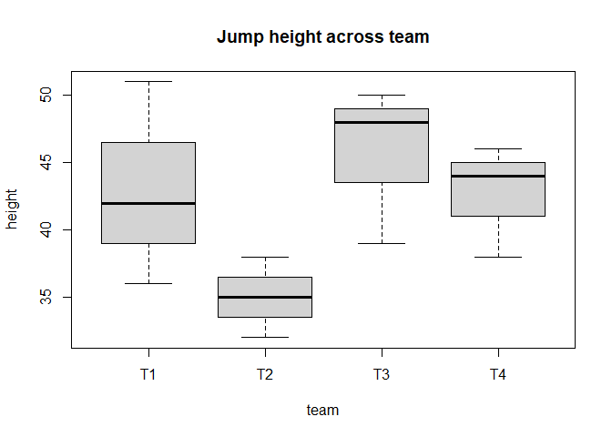
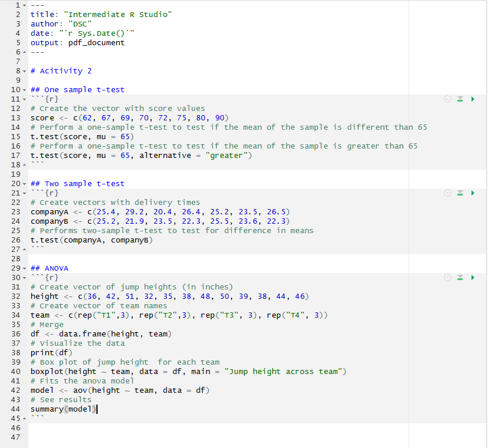

2-Difference in Means
================

# 2-Difference in Means

# Test for Difference in Means (t-tests, ANOVA)

Tips before you start: - You can pull up documentation for a function by
executing `?function_name` (e.g. `?t.test`) in the Console. - Throughout
this workshop, instead of typing in commands directly in the command
line or in the code editor, type them in chunks of code in your .Rmd
file.

## One-sample t-test

**One-sample t-test** is a hypothesis test to see whether the mean of a
dataset is significantly different from a value.

As an example, we have test scores for a sample of 8 students. The
scores are 62, 67, 69, 70, 72, 75, 80, and 90. We use a one-sample
t-test to see if the sample mean is significantly **different** from 65
at the 0.05 level. The null hypothesis is that μ = 65 (μ is a character
usually used to indicate population mean).

In the Code Editor (inside a chunk of code in your RMarkdown file),
create a data vector called `scores`, and then click Ctrl + Enter (PC)
or Cmd + Enter (Mac) to run the code in the command line.

``` r
# Create the vector with score values
score <- c(62, 67, 69, 70, 72, 75, 80, 90)
```

Conduct a one-sample t-test and report the t-statistic and p-value. By
default, the test performs a two-sided test, which means the alternative
hypothesis is that μ is different from 65. Add to the code chunk in your
RMarkdown file, and then send to the command line:

``` r
# Perform a one-sample t-test to test if the mean of the sample is different than 65
t.test(score, mu = 65)
```

    ## 
    ##  One Sample t-test
    ## 
    ## data:  score
    ## t = 2.6539, df = 7, p-value = 0.03275
    ## alternative hypothesis: true mean is not equal to 65
    ## 95 percent confidence interval:
    ##  65.88571 80.36429
    ## sample estimates:
    ## mean of x 
    ##    73.125

The p-value of 0.03275 is smaller than 0.05, so we would reject the null
hypothesis and conclude that the population mean is significantly
different from 65.

You can also test a directional hypothesis, for example if the
alternative hypothesis is that the population mean is **greater** than
65 at the .05 level. To do that, you need to specify the `alternative`
argument in the `t.test()` function. The parameter of this argument must
be one of the following: `"two.sided"` (which is the default),
`"greater"`, or `"less"`, depending on whether the alternative
hypothesis is that the mean is different than, greater than or less than
μ, respectively.

Therefore, to test if the population mean is greater than 65, add the
following in a code chunk in your RMarkdown file, and then send to the
command line:

``` r
# Perform a one-sample t-test to test if the mean of the sample is greater than 65
t.test(score, mu = 65, alternative = "greater")
```

    ## 
    ##  One Sample t-test
    ## 
    ## data:  score
    ## t = 2.6539, df = 7, p-value = 0.01638
    ## alternative hypothesis: true mean is greater than 65
    ## 95 percent confidence interval:
    ##  67.32475      Inf
    ## sample estimates:
    ## mean of x 
    ##    73.125

The p-value of 0.01638 is smaller than 0.05, so we reject the null
hypothesis and conclude that the population mean is significantly
greater than 65.

Try conducting a one-sample t-test where the alternative hypothesis is
the mean is less than 65. What is the R command and what is your
conclusion?

## Two-sample t-test

A **two-sample t-test** is a hypothesis test to see whether there is a
significant difference between the means of two samples.

Consider two pizza companies, A and B. We want to test if there is a
significant difference in the average pizza delivery times between A and
B. Following are the data collected from a sample of delivery times (in
minutes). μA = μB is the null hypothesis

<table>

<thead>

<tr>

<th style="text-align:right;">

Delivery Time A
</th>

<th style="text-align:right;">

Delivery Time B
</th>

</tr>

</thead>

<tbody>

<tr>

<td style="text-align:right;">

25.4
</td>

<td style="text-align:right;">

25.2
</td>

</tr>

<tr>

<td style="text-align:right;">

29.2
</td>

<td style="text-align:right;">

21.9
</td>

</tr>

<tr>

<td style="text-align:right;">

20.4
</td>

<td style="text-align:right;">

23.5
</td>

</tr>

<tr>

<td style="text-align:right;">

26.4
</td>

<td style="text-align:right;">

22.3
</td>

</tr>

<tr>

<td style="text-align:right;">

25.2
</td>

<td style="text-align:right;">

25.5
</td>

</tr>

<tr>

<td style="text-align:right;">

23.5
</td>

<td style="text-align:right;">

23.6
</td>

</tr>

<tr>

<td style="text-align:right;">

26.5
</td>

<td style="text-align:right;">

22.3
</td>

</tr>

</tbody>

</table>

Create two vectors for the delivery time of company A and company B in a
code chunk in your RMarkdown file, and then send it to the command line.

``` r
# Create vectors with delivery times
companyA <- c(25.4, 29.2, 20.4, 26.4, 25.2, 23.5, 26.5)
companyB <- c(25.2, 21.9, 23.5, 22.3, 25.5, 23.6, 22.3)
```

Conduct a two-sample t test and report the t and p values by adding the
following in a code chunk in your RMarkdown file, and then sending it to
the command line:

``` r
# Performs two-sample t-test to test for difference in means
t.test(companyA, companyB)
```

    ## 
    ##  Welch Two Sample t-test
    ## 
    ## data:  companyA and companyB
    ## t = 1.5027, df = 9.0538, p-value = 0.167
    ## alternative hypothesis: true difference in means is not equal to 0
    ## 95 percent confidence interval:
    ##  -0.8856852  4.3999709
    ## sample estimates:
    ## mean of x mean of y 
    ##  25.22857  23.47143

From the output, we can see that the p-value is 0.167 \> 0.05. Hence,
there is no strong evidence showing the difference in the average times
to deliver a pizza between Company A and Company B.

In the same way as for the one-sample t-test, you can specify different
alternative hypothesis in the argument `alternative`. Try conducting a
two-sample t-test where the alternative hypothesis is Company A delivers
pizzas faster than Company B. What is the R command and what’s your
conclusion?

## One-way ANOVA

**One-way ANOVA (Analysis of Variance)** is a hypothesis test to
determine whether the means from more than two populations or groups are
equal or not.

As an example, suppose that four basketball teams took a random sample
of players regarding how high each player can jump (in inches). μ1 = μ2
= μ3 = μ4 is the null hypothesis. The alternative hypothesis is at least
one μ is statistically different from the rest.

We first input the data into an appropriate format (add to a code chunk
in your RMarkdown file, and then send it to the command line).

``` r
# Create vector of jump heights (in inches)
height <- c(36, 42, 51, 32, 35, 38, 48, 50, 39, 38, 44, 46)
# Create vector of team names
team <- c(rep("T1",3), rep("T2",3), rep("T3", 3), rep("T4", 3))
# Merge
df <- data.frame(height, team)
# Visualize the data
print(df)
```

    ##    height team
    ## 1      36   T1
    ## 2      42   T1
    ## 3      51   T1
    ## 4      32   T2
    ## 5      35   T2
    ## 6      38   T2
    ## 7      48   T3
    ## 8      50   T3
    ## 9      39   T3
    ## 10     38   T4
    ## 11     44   T4
    ## 12     46   T4

We can make a boxplot to visualize the data by team. Add the following
to a code chunk in your RMarkdown file, and then send it to the command
line:

``` r
# Box plot of jump height  for each team
boxplot(height ~ team, data = df, main = "Jump height across team")
```

<!-- -->

The function aov() can be used for fitting ANOVA models. The general
form is `aov(response ~ factor, data = data_name)`, where response
represents the response variable and factor the variable that separates
the data into groups. Once the ANOVA model is fit, we use the summary()
function to view the result, which is in a standard ANOVA table. Add the
following to a code chunk in your RMarkdown file, and then send it to
the command line:

``` r
# Fits the anova model
model <- aov(height ~ team, data = df)
# See results
summary(model)
```

    ##             Df Sum Sq Mean Sq F value Pr(>F)
    ## team         3  189.6   63.19   2.148  0.172
    ## Residuals    8  235.3   29.42

With a p-value of 0.172 (which is larger than 0.05), we fail to reject
the null hypothesis. In other words, we do not have enough evidence to
conclude that the mean jump height of any group is different from the
other.

# The R Markdown file

Your Markdown file now may now look like this:



[NEXT STEP: Simple and Multiple Linear Regressions](act-3.html){: .btn
.btn-blue }
