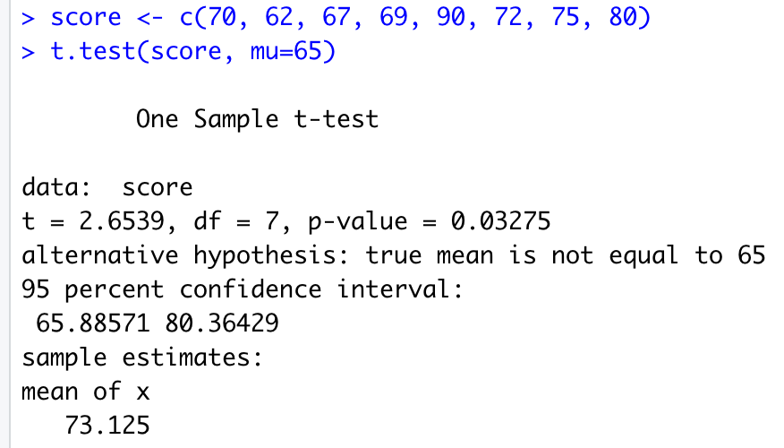
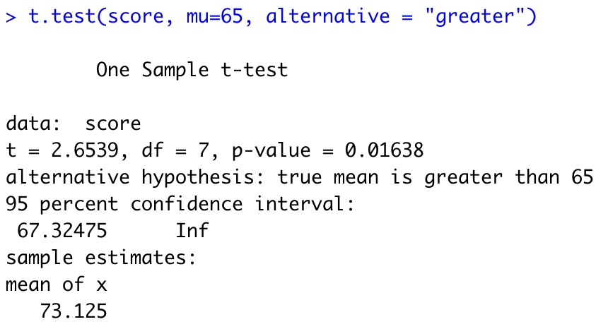
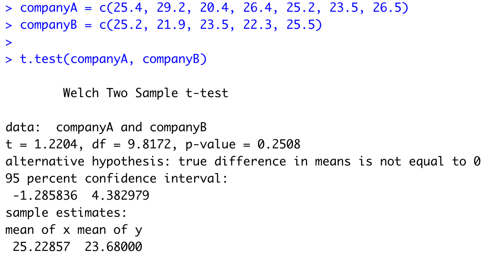
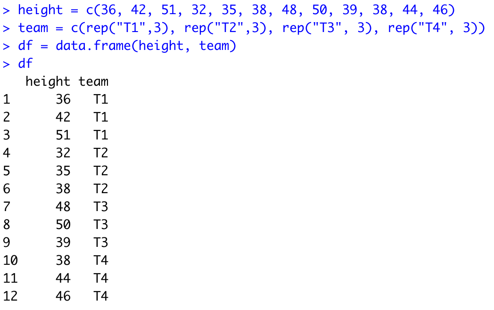
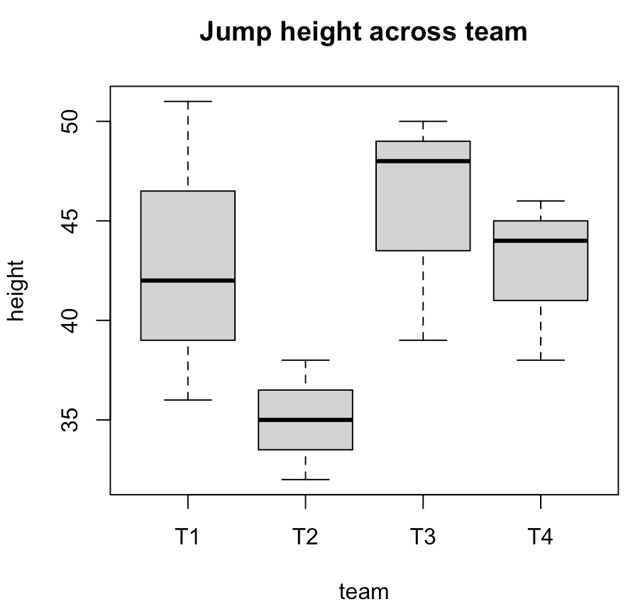
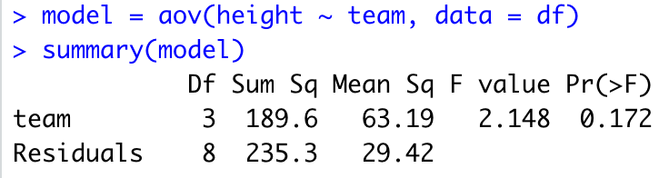
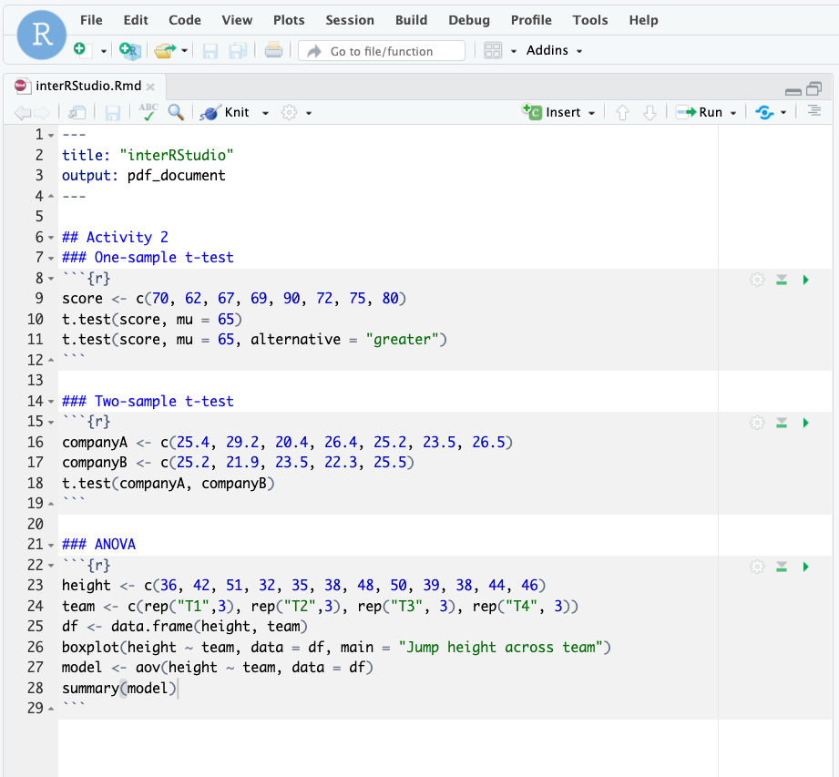

# Test for Difference in Means (t-tests, ANOVA)

Tips before you start:
-   You can pull up documentation for a function by executing `?<function_name>` (e.g. `?t.test`) in the Console.

1.  **One-sample t-test** is a hypothesis test to see whether the mean of a data set is significantly different from a value.

    As an example, we have a test scores sample of 8 students. The scores are 67, 69, 70, 72, 75, and 78. We use a one-sample t-test to see if the sample mean is significantly **different** from 65 at the 0.05 level. μ = 65 is the null hypothesis (μ is a character usually used to indicate population mean.)
    -   In the Code Editor (your RMarkdown file), create a data vector called `score`
        
        ```
        score <- c(70, 62, 67, 69, 90, 72, 75, 80)
        ```
        
    -   Conduct a one-sample t test and report the t-statistic and p-value
    
        ```
        t.test(score, mu = 65)
        ```
        
        
        
        The p-value of 0.03275 < 0.05, we reject the null hypothesis and conclude that the sample mean is significantly different from 65.
        
    -   If we want to test if sample mean is **greater** than 65 at the .05 level. We add an option alternative, which must be one of the following: two-sided (which is the default), greater or less depending on whether the alternative hypothesis is that the mean is different than, greater than or less than μ, respectively.

        ```
        t.test(score, mu = 65, alternative = "greater")
        ```
        
        
        
        The p-value of 0.01638 < 0.05, we reject the null hypothesis and conclude that the mean is significantly greater from 65.
        
    -   Try conducting a one-sample t-test where the alternative hypothesis is the mean is less than 45. What is the R command and what is your conclusion?

2.  **Two-sample t-test** is a hypothesis test to see whether there is a significant difference between the means of two samples.

    Consider two pizza companies, A and B. We want to test if there is a significant difference in the average pizza delivery times between A and B. Following are the data collected from a sample of delivery times (in minutes). μA = μB is the null hypothesis.
    
    <table>
        <tr>
            <td>Delivery Time A</td>
            <td>25.4</td>
            <td>29.2</td>
            <td>20.4</td>
            <td>26.4</td>
            <td>25.2</td>
            <td>23.5</td>
            <td>26.5</td>
        </tr>
        <tr>
            <td>Delivery Time B</td>
            <td>25.2</td>
            <td>21.9</td>
            <td>23.5</td>
            <td>22.3</td>
            <td>25.5</td>
        </tr>
    </table>
    
    -   Create two vectors for the delivery time of company A and company B in the console.
    
        ```
        companyA <- c(25.4, 29.2, 20.4, 26.4, 25.2, 23.5, 26.5)
        companyB <- c(25.2, 21.9, 23.5, 22.3, 25.5)
        ```
    
    -   Conduct a two-sample t test and report the t and p values in the Console:
    
        ```
        t.test(companyA, companyB)
        ```
        
        
        
        From the output, we can see that the p-value is 0.2508 > 0.05. Hence, there is no strong evidence showing the difference in the average times to deliver a pizza between Company A and Company B.
        
    -   Try conducting a two-sample t-test where the alternative hypothesis is Company A delivers pizzas faster than Company B. What is the R command and what’s your conclusion?
3.  **One-way ANOVA (Analysis of Variance)** is to determine whether the means from more than two populations or groups are equal or not.

    As an example, suppose that four basketball teams took a random sample of players regarding how high each player can jump (in inches). μ1 = μ2 = μ3 = μ4 is the null hypothesis. The alternative hypothesis is at least one μ is statistically different from the rest.
    -   We first input the data into an appropriate format.
        
        ```
        height <- c(36, 42, 51, 32, 35, 38, 48, 50, 39, 38, 44, 46)
        team <- c(rep("T1",3), rep("T2",3), rep("T3", 3), rep("T4", 3))
        df <- data.frame(height, team)
        ```
        
        
        
    -   We can make a boxplot to visualize the data by team.
    
        ```
        boxplot(height ~ team, data = df, main = "Jump height across team")
        ```
        
        
    
    -   The function aov() can be used for fitting ANOVA models. The general form is `aov(response ~ factor, data=data_name)` where response represents the response variable and factor the variable that separates the data into groups. Once the ANOVA model is fit, we use the summary() function to view the result, which is in a standard ANOVA table.
    
        ```
        model <- aov(height ~ team, data = df)
        summary(model)
        ```
        
        
        
        With a p-value of 0.172, we fail to reject the null hypothesis. In other words, we don’t have enough evidence to conclude that any mean is different.
        
 4. Your Markdown file now may look like this:
 

[NEXT STEP: Simple and Multiple Linear Regressions](act-3.html){: .btn .btn-blue }
