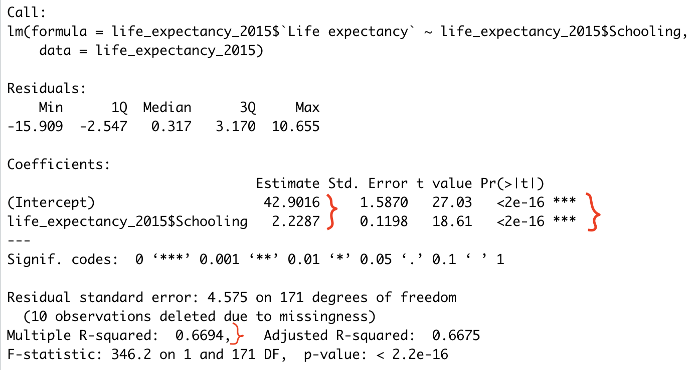
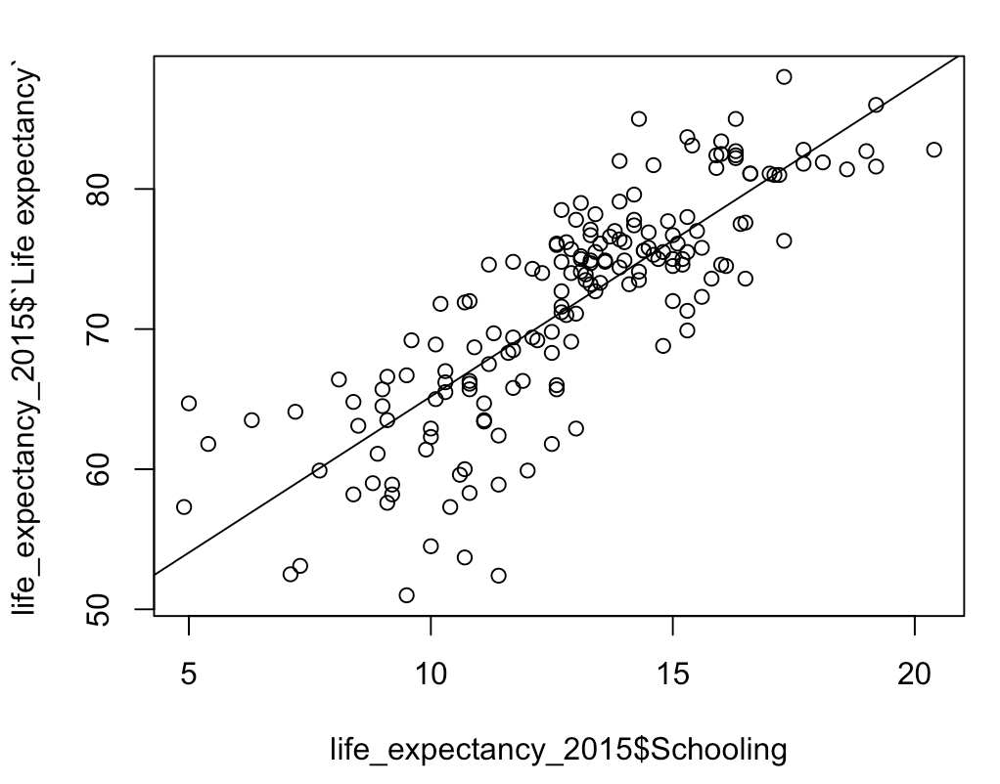
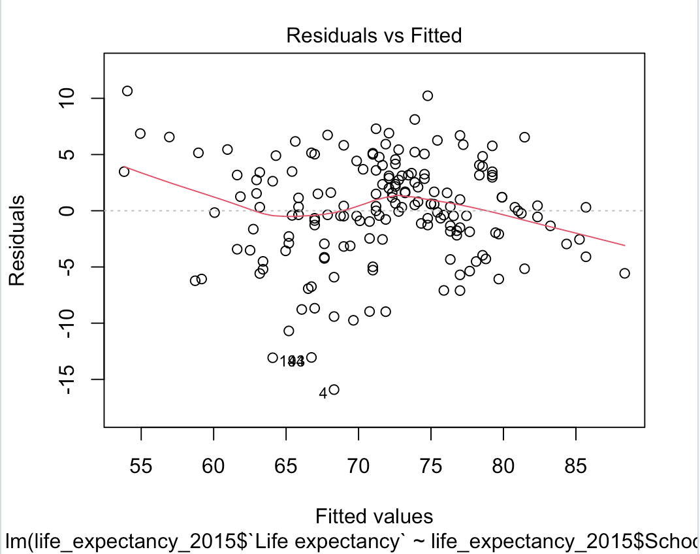
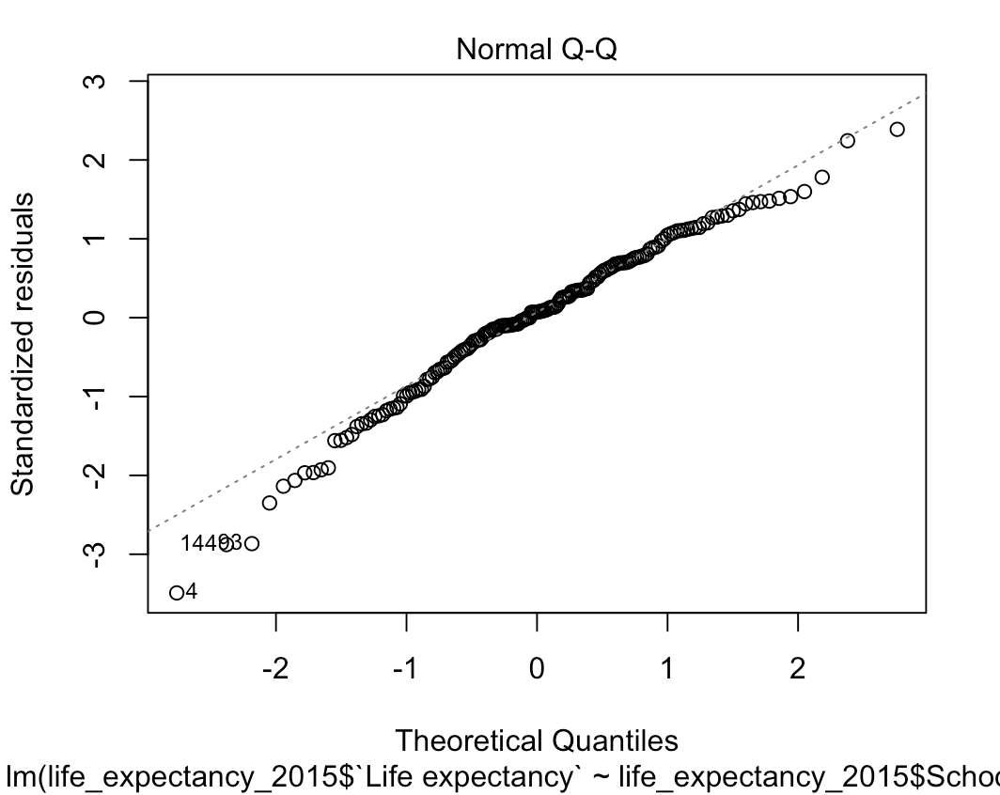
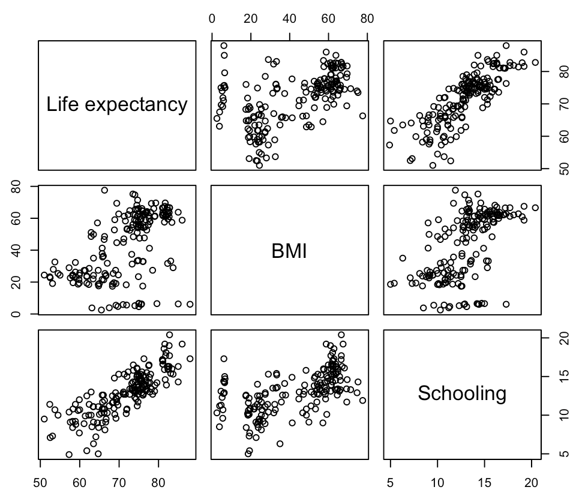
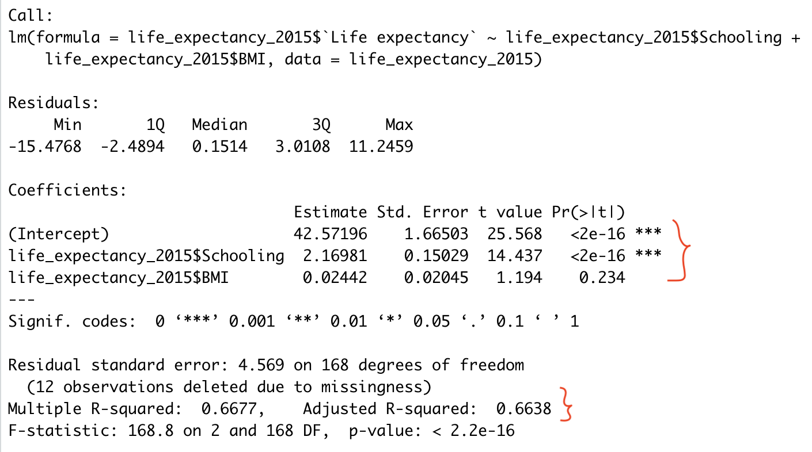
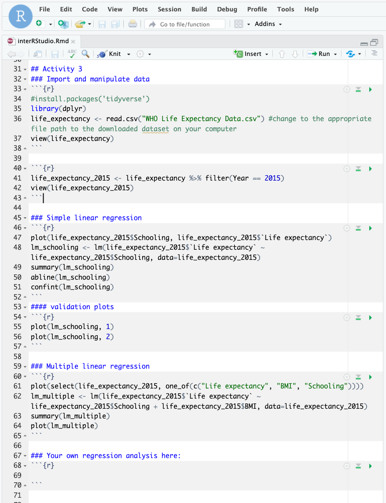

# Linear Regressions

Tips before you start:
-   You can pull up documentation for a function by executing `?function` (e.g. `?lm`) in the Console.
-   Have the tidyverse package installed and the dplyr library loaded in RStudio.

    ```
    install.packages('tidyverse')
    library(dplyr)
    ```
    
-   [dplyr cheat sheet](https://rstudio.com/wp-content/uploads/2015/02/data-wrangling-cheatsheet.pdf){:target="_blank"}

In this activity, we build linear models to predict the life expectancy with one or more independent/explanatory variables. Download the Life Expectancy dataset [here](https://uviclibraries.github.io/rstudio-intermediate/docs/WHO_Life_Expectancy_Data.csv){:target=“\_blank”} and save it in your current directory or somewhere you can find later. [Data source.](https://www.kaggle.com/kumarajarshi/life-expectancy-who){:target="_blank"}

1.  **Import the dataset** by typing the following:

    ```
    life_expectancy <- read.csv("WHO Life Expectancy Data.csv") #change to the appropriate file path to the downloaded dataset on your computer
    head(life_expectancy,2)
    ```
    
    We are going to use only data from the year of 2015 as it is most recent. Do filtering by `dplyr`, which we cover in the workshop [Introduction to RStudio/Data Manipulation](https://uviclibraries.github.io/rstudio/tidyverse-data.html){:target="_blank"}:
    
    ```
    life_expectancy_2015 <- life_expectancy %>% filter(Year == 2015)
    head(life_expectancy_2015,2)
    ```
    
    The `lm(...)` command creates linear regression models. It takes the following format:
    
    ```
    lm([response variable] ~ [predictor variables], data = [data source])
    ```

2.  **Simple linear regression:**

    -   A plot of Schooling vs Life expectancy shows that a linear relationship is reasonable. `life_expectancy_2015$Schooling` selects the `Schooling` column in the `life_expectancy_2015` dataset; the sane applies for the `Life expectancy` column. Run:
    
        ```
        plot(life_expectancy_2015$Schooling, life_expectancy_2015$`Life.expectancy`)
        ```
    
    -   We create a simple linear regression model where the response variable is `Life expectancy` and the predictor variable is `Schooling`. The model can be written as:
    
        life expectancy = slope * schooling + intercept
        **In R:**
        
        ```
        lm_schooling <- lm(`Life.expectancy` ~ Schooling, data=life_expectancy_2015)
        summary(lm_schooling)
        ```
        
        
        
        The small p-values (<0.001) indicate that the estimates for the intercept and slope estimates are statistically significant. The R-squared value of 0.6694 indicates that 66.94% of the variation in Life expectancy can be explained by Schooling. We can write the model mathematically as:
            **Life expectancy = 2.2287 * Schooling + 42.9016**
    
    -   Add this regression line to the plot with `abline(lm_schooling)`
    
        
    
    -   Get the 95% confidence interval for the coefficient estimates: `confint(lm_schooling)`
    -   Linear regression makes several assumptions about the data:
        
        _Linearity of the data & constant variance:_ we want to check the Residuals vs Fitted plot for no pattern, the red line should be fairly flat, the points should be equally scattered.
        
        `plot(lm_schooling, 1)`
        
        
        
        _Normality:_ points should be close to the line in the Normal Q-Q plot.
        
        `plot(lm_schooling, 2)`
        
        
        
        Overall the assumptions are met. However, there seem to be a few outliers seen in the Schooling vs. Life expectancy plot. We may want to examine these data points in further analysis.

3.  **Multiple linear regression:**

    -   We want to expand our model to consider an additional predictor variable, BMI. Run the following code:
    
        ```
        plot(select(life_expectancy_2015, one_of(c("Life expectancy", "BMI", "Schooling"))))
        ```
        
        
        
        From the plot, BMI doesn’t look as good as Schooling as a predictor of Life expectancy. But we will go ahead and fit a multiple regression model to have a concrete result.
    
    -   Create a multiple linear regression model where the response variable is Life expectancy and the independent variables are BMI and Schooling. The model can be written as:
        Life expectancy = slope_1 * BMI + slope_2 * Schooling + intercept
        
        Run the following code for that model:
        
        ```
        lm_multiple <- lm(life_expectancy_2015$`Life expectancy` ~ life_expectancy_2015$Schooling + life_expectancy_2015$BMI, data=life_expectancy_2015)
        summary(lm_multiple)
        ```
        
        
        
        As we thought, BMI is not a significant variable with a p-value of 0.234. The model is still significant however, with p-value of 2.2e^-16, because Schooling is included. We conclude that the simple regression model adequately fits the data. For the sake of completeness, the multiple regression model can be written as:
        
        Life expectancy = 2.16981 * Schooling + 0.02442 * BMI + 42.57196
    
    -   Similar to the simple model, this command produces graphs to check the model assumptions.

        ```
        plot(lm_multiple)
        ```

4.  **Conduct a single or multiple regression analysis with other variables of your choosing:**
- Make a scatter plot to explore their linear relationship
- Build a linear regression model 
- Assess the results. 
Let the instructors know if you need help! This activity's code in your Markdown file may look like this:


[NEXT STEP: Interactive Data Dashboard With RShiny](act-4.html){: .btn .btn-blue }
