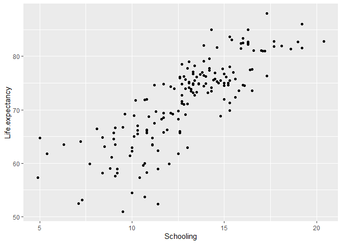
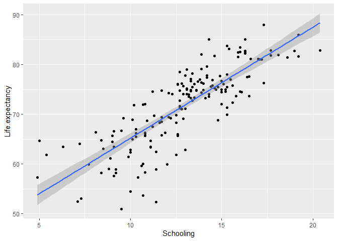
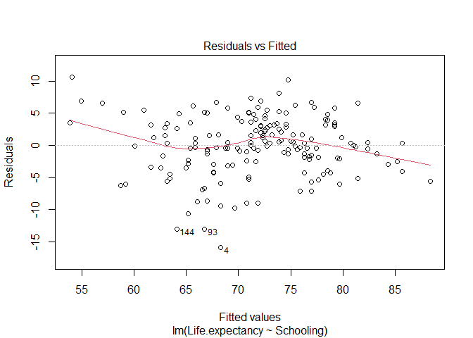
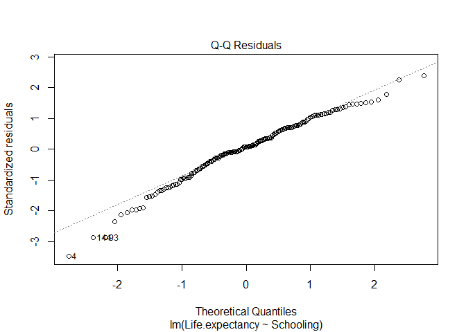
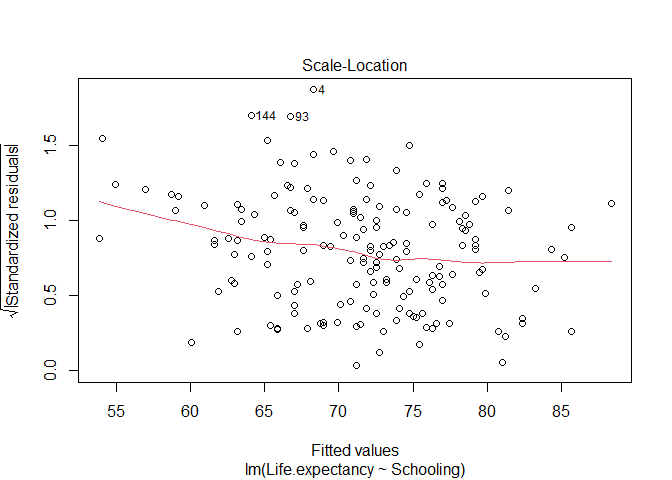

3-Linear Regressions
================

# Linear Regressions

## Tips before you start:

- You can pull up documentation for a function by executing
  `?function_name` (e.g. `?t.test`) in the Console.
- Throughout this workshop, instead of typing in commands directly in
  the command line or in the code editor, type them in chunks of code in
  your .Rmd file.
- Have the tidyverse package installed and loaded in RStudio:

``` r
# only need to run once in the console if tidyverse not installed: install.packages('tidyverse')
library(tidyverse)
```

- If you need a reminder on data manipulation functions, check out the
  [dplyr cheat
  sheet](https://rstudio.github.io/cheatsheets/html/data-transformation.html){:target=“\_blank”}

## Download data

In this activity, we will build linear models to predict life expectancy
with one or more independent/explanatory variables. Download the Life
Expectancy dataset by right clicking on [this
text](https://uviclibraries.github.io/rstudio-intermediate/docs/WHO_Life_Expectancy_Data.csv){:target=“\_blank”}
and select “Download linked file as”. Save it in the same folder as your
current R Markdown file.

The source of this data is [this
website.](https://www.kaggle.com/kumarajarshi/life-expectancy-who){:target=“\_blank”}

## Import the data

**Import the dataset** by typing the following in a code chunk, and then
sending it to the command line:

``` r
# Import data
life_expectancy <- read.csv("WHO_Life_Expectancy_Data.csv") # change to the appropriate file path to the downloaded dataset on your computer
```

Let’s then preview the data to see if it was uploaded correctly. As you
can see, the data shows multiple variables possibly related to overall
life expectancy for different countries over the years.

``` r
head(life_expectancy)
```

    ##       Country Year     Status Life.expectancy Adult.Mortality infant.deaths
    ## 1 Afghanistan 2015 Developing            65.0             263            62
    ## 2 Afghanistan 2014 Developing            59.9             271            64
    ## 3 Afghanistan 2013 Developing            59.9             268            66
    ## 4 Afghanistan 2012 Developing            59.5             272            69
    ## 5 Afghanistan 2011 Developing            59.2             275            71
    ## 6 Afghanistan 2010 Developing            58.8             279            74
    ##   Alcohol percentage.expenditure Hepatitis.B Measles  BMI under.five.deaths
    ## 1    0.01              71.279624          65    1154 19.1                83
    ## 2    0.01              73.523582          62     492 18.6                86
    ## 3    0.01              73.219243          64     430 18.1                89
    ## 4    0.01              78.184215          67    2787 17.6                93
    ## 5    0.01               7.097109          68    3013 17.2                97
    ## 6    0.01              79.679367          66    1989 16.7               102
    ##   Polio Total.expenditure Diphtheria HIV.AIDS       GDP Population
    ## 1     6              8.16         65      0.1 584.25921   33736494
    ## 2    58              8.18         62      0.1 612.69651     327582
    ## 3    62              8.13         64      0.1 631.74498   31731688
    ## 4    67              8.52         67      0.1 669.95900    3696958
    ## 5    68              7.87         68      0.1  63.53723    2978599
    ## 6    66              9.20         66      0.1 553.32894    2883167
    ##   thinness..1.19.years thinness.5.9.years Income.composition.of.resources
    ## 1                 17.2               17.3                           0.479
    ## 2                 17.5               17.5                           0.476
    ## 3                 17.7               17.7                           0.470
    ## 4                 17.9               18.0                           0.463
    ## 5                 18.2               18.2                           0.454
    ## 6                 18.4               18.4                           0.448
    ##   Schooling
    ## 1      10.1
    ## 2      10.0
    ## 3       9.9
    ## 4       9.8
    ## 5       9.5
    ## 6       9.2

## Prepare the data

We are going to use only data from the year of 2015 as it is most
recent. For this, use the `filter()`function from `dplyr` (i.e.g, part
of the `tidyverse` package), which we cover in the workshop
[Introduction to
RStudio](https://uviclibraries.github.io/rstudio/tidyverse-data.html){:target=“\_blank”}:

``` r
# Filter the dataset
life_expectancy_2015 <- life_expectancy %>% 
  filter(Year == 2015)

# Check results
head(life_expectancy_2015)
```

    ##               Country Year     Status Life.expectancy Adult.Mortality
    ## 1         Afghanistan 2015 Developing            65.0             263
    ## 2             Albania 2015 Developing            77.8              74
    ## 3             Algeria 2015 Developing            75.6              19
    ## 4              Angola 2015 Developing            52.4             335
    ## 5 Antigua and Barbuda 2015 Developing            76.4              13
    ## 6           Argentina 2015 Developing            76.3             116
    ##   infant.deaths Alcohol percentage.expenditure Hepatitis.B Measles  BMI
    ## 1            62    0.01               71.27962          65    1154 19.1
    ## 2             0    4.60              364.97523          99       0 58.0
    ## 3            21      NA                0.00000          95      63 59.5
    ## 4            66      NA                0.00000          64     118 23.3
    ## 5             0      NA                0.00000          99       0 47.7
    ## 6             8      NA                0.00000          94       0 62.8
    ##   under.five.deaths Polio Total.expenditure Diphtheria HIV.AIDS        GDP
    ## 1                83     6              8.16         65      0.1   584.2592
    ## 2                 0    99              6.00         99      0.1  3954.2278
    ## 3                24    95                NA         95      0.1  4132.7629
    ## 4                98     7                NA         64      1.9  3695.7937
    ## 5                 0    86                NA         99      0.2 13566.9541
    ## 6                 9    93                NA         94      0.1 13467.1236
    ##   Population thinness..1.19.years thinness.5.9.years
    ## 1   33736494                 17.2               17.3
    ## 2      28873                  1.2                1.3
    ## 3   39871528                  6.0                5.8
    ## 4    2785935                  8.3                8.2
    ## 5         NA                  3.3                3.3
    ## 6   43417765                  1.0                0.9
    ##   Income.composition.of.resources Schooling
    ## 1                           0.479      10.1
    ## 2                           0.762      14.2
    ## 3                           0.743      14.4
    ## 4                           0.531      11.4
    ## 5                           0.784      13.9
    ## 6                           0.826      17.3

## Simple linear regression model

Linear regressions are used when we want to investigate relationships
between variables. For example, in this case, imagine we want to
investigate if overall life expectancy is related to the level of
schooling of the country. This is different than in the previous
activity, when we wanted to test if different groups had different
means.

The `lm()` command creates a linear regression model. It takes the
following format:

``` r
lm(response_variable ~ predictor_variables, data = data_source)
```

In this case, life expectancy is our response variable (i.e., we expect
it to respond to the level of schooling), and schooling is our predictor
variable (i.e., we expect it to predict life expectancy).

### Vizualise trends

To start, you first want to visualize the relationship in a plot to see
if a linear relationship is reasonable. We will be using ggplot (part of
the `tidyverse` package) to plot throughout this workshop. This was
covered in the workshop [Introduction to
RStudio](https://uviclibraries.github.io/rstudio/ggplot2-data.html){:target=“\_blank”}:

Type this in a code chunk and then send it to the command line:

``` r
# Create a scatter plot of life expectancy by Schooling
ggplot(data = life_expectancy_2015, # specify the data
       aes(x = Schooling, y = Life.expectancy)) + # specify the variables
  geom_point() # plot a scatter plot
```

<!-- -->

### Fit a siple linear regression

The plot shows that a linear relationship is reasonable. Therefore, we
will create a simple linear regression model where the response variable
is `Life expectancy` and the predictor variable is `Schooling`. The
model can be written as:

life expectancy = intercept + slope \* schooling

**In R,** type this in a code chunk and send it to the command line:

``` r
# Fit the model
lm_schooling <- lm(Life.expectancy ~ Schooling, data = life_expectancy_2015)

# See the results of the model
summary(lm_schooling)
```

    ## 
    ## Call:
    ## lm(formula = Life.expectancy ~ Schooling, data = life_expectancy_2015)
    ## 
    ## Residuals:
    ##     Min      1Q  Median      3Q     Max 
    ## -15.909  -2.547   0.317   3.170  10.655 
    ## 
    ## Coefficients:
    ##             Estimate Std. Error t value Pr(>|t|)    
    ## (Intercept)  42.9016     1.5870   27.03   <2e-16 ***
    ## Schooling     2.2287     0.1198   18.61   <2e-16 ***
    ## ---
    ## Signif. codes:  0 '***' 0.001 '**' 0.01 '*' 0.05 '.' 0.1 ' ' 1
    ## 
    ## Residual standard error: 4.575 on 171 degrees of freedom
    ##   (10 observations deleted due to missingness)
    ## Multiple R-squared:  0.6694, Adjusted R-squared:  0.6675 
    ## F-statistic: 346.2 on 1 and 171 DF,  p-value: < 2.2e-16

There is a lot of information in this output:

- **Call**: a reminder of the model you just fitted.

- **Residuals**: a summary of the distribution of the residuals of the
  model. The residuals are the difference between the observed values
  and the value predicted by the model. You want this distribution to be
  normal, and comparing these values can help you inspect that, however,
  you will typically inspect this in other ways (see topic on
  assumptions below).

- **Coefficients**: this is the main result of the model. It shows you
  the estimated values for the intercept and the slope (i.e., the slope
  for Schooling, in this case), the standard error of these estimates
  (i.e., the uncertainty around these estimates), and the results of a
  t-test (the t-value and the p-value associated with it) testing
  whether these values are significantly different from 0.

  - The small p-values for the coefficients (\<0.001) indicate that the
    estimates for the intercept and slope are statistically significant.
    The specific values mean that we can write the model mathematically
    as: **Life expectancy = 42.9016 + 2.2287 \* Schooling**.

- The **bottom part** of the results gives you a summary of the overall
  fit of the model (i.e., how well the model explains your data). The
  most important are the R-squared, which tells you how much variance
  the model explains (in this case, the R-squared value of 0.6694
  indicates that 66.94% of the variance in Life Expectancy is explained
  by Schooling), and the results associated with the F-statistic, which
  tells you the significance of your entire model (and not just each
  individual coefficients, as the t-tests above show).

  - The high R-square and the small p-value here (\<0.001) tell you that
    this model is a good fit that explain a lot of variance in your
    data.

You might also want to get the 95% confidence interval for the
coefficient estimates:

``` r
# Get confidence intervals of model estimates
confint(lm_schooling)
```

    ##                2.5 %    97.5 %
    ## (Intercept) 39.76897 46.034216
    ## Schooling    1.99229  2.465164

We can also visualize this model by adding a regression line to the
plot.

``` r
# Create a scatter plot of life expectancy by Schooling with the fitted line of a linear regression
ggplot(data = life_expectancy_2015, # specify the data
       aes(x = Schooling, y = Life.expectancy)) + # specify the variables
  geom_point() + # plot a scatter plot
  geom_smooth(method = "lm") # add a fitted line with confidence interval using the linear model (lm) method
```

<!-- -->

It seems like the line explains the trend in the data well. However, you
will still want to check if the model meets the assumptions before you
make any inferences from this model.

### Assumptions

Linear regression makes several assumptions about the data, which form
the acronym LINE: **l**inearity, **i**ndependence, **n**ormality, and
**e**qual variance of the residuals. To inspect these assumptions, you
use the function `plot()` on a `lm` object in R (i.e. the object with
results of a linear model), which plots 4 useful diagnostics plots for
regression models.

- **L**inearity: the model assumes the relationship between the
  variables is a linear relationship. You can check that visually in the
  scatter plot above. Another way to inspect is to plot the residuals of
  the model as a function of the fitted values. If the relationship is
  linear, the line should be flat (i.e., observations are equally
  distributed above and below the line of fitted values of a linear
  model).

``` r
# Plot residuals versus fitted values
plot(lm_schooling, 1) # the number 1 tells R to plot the 1st diagnostic plot
```

<!-- -->

The line is not perfectly flat, but it is reasonably close. Still, it
suggests it might be good to examine the points with small and large
fitted values as they seem to be the ones deviating from the flat line.

- **I**ndependence: the model assumes each observation is independent of
  the others. Although there are ways to visually inspect this
  assumption if you have concerns about temporal or spatial
  non-independence, usually this assumption is met by considering the
  structure of the data. In this case, we can reasonaly assume that the
  contruies are independent observations.

- **N**ormality of the residuals: the model assumes the residuals are
  normally distributed. To inspect this, you can check a Q-Q Plot of the
  residuals. In this point, the points should close to the line
  (i.e. the line shows what wouls be expected for a normal
  distribution).

``` r
# Plot Q-Q plot of the residuals
plot(lm_schooling, 2) # the number 2 tells R to plot the 2nd diagnostic plot
```

<!-- -->

Again, overal the points are close to the line, but there seem to be a
few outliers. We may want to examine these data points in further
analysis.

- **E**qual variance of the residuals: the model assumes the spread of
  the residuals around the fitted line (i.e. their variance) is the same
  for the entire range of the predictor variable. To inspect that, you
  can plot a scatter plot of standardized residuals versus fitted
  values. The standardized residuals are just teh residuals standardized
  by their standard deviation, which makes comparison between models and
  identification of outlines easier, but you don’t need to worry much
  about that here. Mainly, you want to check if this plot has a flat
  line, which would tell you the residuals have the same variance same
  across the model.

``` r
# Plot Q-Q plot of the residuals
plot(lm_schooling, 3) # the number 3 tells R to plot the 3rd diagnostic plot
```

<!-- -->

Again, the model seels to meet the assumption with a few outliers that
might need to be examined further.

## Multiple linear regression

    -   We want to expand our model to consider an additional predictor variable, body mass index (BMI). Run the following code:

    life_expectancy_2015 %>% 
        select(Life.expectancy, BMI, Schooling) %>% # get the relevant columns form the dataset
        pairs() # plot pairwise correlation plots


From the plot, BMI doesn’t look as good as Schooling as a predictor of
Life expectancy. But we will go ahead and fit a multiple regression
model to have a concrete result.

- Create a multiple linear regression model where the response variable
  is Life expectancy and the independent variables are BMI and
  Schooling. The model can be written as:

Life expectancy = slope_1 \* BMI + slope_2 \* Schooling + intercept

Run the following code for that model:

    lm_multiple <- lm(Life.expectancy ~ Schooling + BMI, data = life_expectancy_2015)
    summary(lm_multiple)


As we thought, BMI is not a significant variable with a p-value of
0.234. The model is still significant however, with p-value of 2.2e^-16,
because Schooling is included. We conclude that the simple regression
model adequately fits the data. For the sake of completeness, the
multiple regression model can be written as:

Life expectancy = 2.16981 \* Schooling + 0.02442 \* BMI + 42.57196

- Similar to the simple model, this command produces graphs to check the
  model assumptions.

<!-- -->

    plot(lm_multiple)

4.  **Conduct a single or multiple regression analysis with other
    variables of your choosing:**

- Make a scatter plot to explore their linear relationship
- Build a linear regression model
- Assess the results. Let the instructors know if you need help! This
  activity’s code in your Markdown file may look like this:


[NEXT STEP: If statements, loops, and custom functions](act-4.html){:
.btn .btn-blue }
