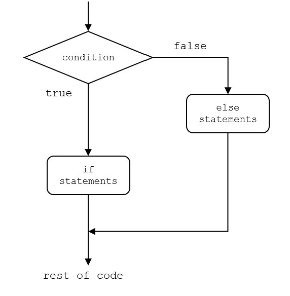
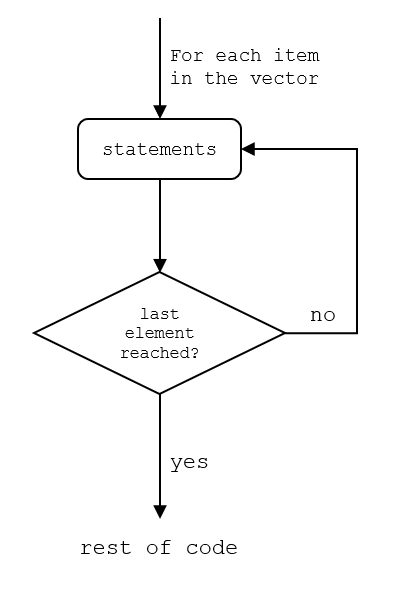

```{r setup, include=FALSE}
# This code block is to the benefit of anyone working with the .Rmd file to edit the workshop material, rather than participating in the workshop. Hence, it should always be setup to include = FALSE, so it does not appear in the knitted .md file 

# Make echo = TRUE the default option
knitr::opts_chunk$set(echo = TRUE)

# Uncomment the install.packages if you haven't installed and loaded the 'readxl' package
#install.packages("readxl")
library(readxl)

# Function that will generate the .md text that creates the toggle button to show answers for activities. To use this function, you should use it inside an code chunk set with echo = FALSE (meaning, do not show) and results = "asis", meaning print the results not in a output chunk. Check the document below for an example
startCodeDetailsBlock <- function(summaryText = "Check Your Code") {
  # Use cat to directly output the string without quotes and avoid unintended newlines
  cat(
    "{::options parse_block_html=&apos;true&apos; /}<details><summary markdown='span'>", summaryText, "</summary>"
  )
}

# Function that will generate the .md text that ends the toggle button to show answers for activities. Same usage applied as explained for function above.
endCodeDetailsBlock <- function() {
  cat("</details>{::options parse_block_html=&apos;false&apos;/}")
}
```

# If Statements, Loops, Custom Functions

## Tips before you start:

-   You might want to start a new .Rmd file for this activity

-   Throughout this workshop, instead of typing in commands directly in the command line or in the code editor, type them in chunks of code in your .Rmd file.

This sections covers some intermediate coding skills that you can use to make your code more efficient: ifs, for loops, and custom functions. 

**If** statements and **loops** help implement logical operations in any programming language. A **function** groups operations into a single line of code which can be used repeatedly with different inputs. We will learn how to write these operations in R through basic examples.

## If Statements

An if statement in R has the following syntax:

```{r if-generic, eval = FALSE}
if (<condition>) {
  <statement1>
  <statement2>
  ...
  <statementX>
} 
```


If the condition is True, then the statements inside `{}` are executed. If the condition is False, the statements are ignored and nothing happens. Try running this block of code which will print out a message if x is smaller than 10:

```{r if}
# Create an object called x with the value of 5
x <- 5

# If x is smaller then 10
if (x < 10) {
  # Print the sentence "x is smaller than 10
  print("x is smaller than 10!")
}
```
<div class="task-box" markdown="1">
&#11088; [Task 4-1]{.underline} 

**Use an if statement**

Change the condition in the if statement above so that when you run the code, nothing is printed.

```{r echo = F, results='asis'}
startCodeDetailsBlock(summaryText = "Check your code")
```

```{r task-4-1}
# If x is larger then 10
if (x > 10) {
  # Print the sentence "x is smaller than 10
  print("x is smaller than 10!")
}
```

```{r echo = F, results='asis'}
endCodeDetailsBlock()
```
</div>

We can also edit the if statements to include an `else` clause to execute another statement if the condition is False. For example:
```{r if-else}
# Change x to the value of 10
x <- 10 

# If-else statement
if (x < 10) { # If x is smaller than 10
  print("x is smaller than 10!") # print that x is smaller than 5
} else { # if x is NOT smaller than 10
  print("x is larger than or equal to 10!") # print that x is larger or equal to 10
}
```


How about checking more conditions? Use `else if`! `else if` will create a new `if` statement after the original `if else`, as shown in the figure below:


You can create as many new chains of `if` and `if else` a you want! For example, any guesses which message the code will print out?

```{r if-else-if, eval = FALSE}
x <- 12
if (x < 5) {
  print("small x")
} else if (x < 10) {
  print("medium x")
} else if (x < 15) {
  print("large x")
} else {
  print("very large x")
}
```

<div class="task-box" markdown="1">
&#11088; [Task 4-3]{.underline} 

**Create an else if chain of statements**

Change a chain of `if` and `else if` statements that print the letter grade (i.e., `print("the grade is A"`) for percentage scores according to [Uvic's Grading Standards](https://www.uvic.ca/humanities/atwp/current-students/grading/index.php). You can have the percentage score in a object called score, which will receive a value from 0 to 100.

```{r echo = F, results='asis'}
startCodeDetailsBlock(summaryText = "Check your code")
```

```{r task-4-2}
# Just a random score value between 0 and 100
score <- 75

if (score < 50) { # if the score is smaller than 50
  print("the grade is F") # print the grade is F
} else if (score < 60) { # if not smaller than 50 and smaller than 60
  print("the grade is D") # print the grade is D
} else if (score < 70) { # if not smaller than 60 and smaller than 70
  print("the grade is C") # print the grade is C
} else if (score < 80) { # if not smaller than 70 and smaller than 80
  print("the grade is B") # print the grade is B
} else { # if not any of the above
  print("the grade is A") # print the grade is A
}
```

```{r echo = F, results='asis'}
endCodeDetailsBlock()
```
</div>


## Loops

A for loop runs the same lines of code for a set of values in a vector. For example, imagine you have a vector of percentage scores of students (we can use the same one from Activity 2), and we want to assign them a letter grade for each of these values. That means, you want to apply the `if` and `if else` chain that you just created in the section above to each of the values of scores in your vector. This is where a `for` loop comes in handy.

The syntax of `for` loops is the following:
```{r, eval = FALSE}
for (i in <vector>) {
  <statement1>
  <statement2>
  ...
  <statementX>
}
```


What the `for` loop does is subsequentially run the statements for each item in the vector, until the last item is reached, at which point the `for` loop stops.

For example, using the scores from Activity 2, you could add the `if` and `else if` chain inside the for loop, and it will print the letter grade for each value of the vector. 
```{r for}
# Create the vector of scores
score <- c(75, 91, 68, 83, 66, 94, 85, 86, 75, 80)

# Run the for-loop for each score in the vector
for (i in score) { # this sets each item of the vector score to i, starting with the first item, and so on
  if (i < 50) { # if i (i.e. the item from the vector score) is smaller than 50...
    print("the grade is F") # print the letter grade...
  } else if (i < 60) { # and so on
    print("the grade is D")
  } else if (i < 70) {
    print("the grade is C")
  } else if (i < 80) {
    print("the grade is B")
  } else {
    print("the grade is A")
  }
}
```
Note that, inside the `for` loop, the values of the vector are called by `i` (and not the vector name). You defined this `i` object in the `for` loop call, by saying `for(i in score)`. This is a temporary object created inside the `for` loop, and that takes the value of each item in the vector each time the statements are run. You don't have to call this `i`, you could call it however you like, as long as it follows R's rules for naming objects.

Another very important point in learning how to use `for` loops is knowing how to save results of a `for` loop in an appropriate way. The best way to do this is to create an object outside the `for` loop where you will save the results of each iteration of the loop. For that, is it useful to have `i` be a sequence of numbers for locations in vectors, so that you can call in certain locations from a vector, and then save in the same location in another vector. 

Here's an example for the scores:

```{r for-loop-saved}
# Create the vector of scores
score <- c(75, 91, 68, 83, 66, 94, 85, 86, 75, 80)

# Create a vector where letter grades will be saved. The vector contains NA values, with the same length of the score vector
grades <- rep(NA, times = length(score))

# Note that here, before running the for loop, the vector of grades is made only of NA values
grades

# Run the for-loop for each score in the vector. Now, instead of running for each value of the
# vector "score", we will run the for loop for a vector of numbers, from 1 until the length of the vector scores

for (i in 1:length(score)) { 
  
  # instead of calling i inside the if condition, we are indexin the vector "score" by the number in i
  if (score[i] < 50) { # score[i] meand the ith position in the vector "score"
    grades[i] <- "F" # Instead of printing the grade, we now assign the grade to the ith location on the vector "grades"
  } else if (score[i] < 60) { # and so on
    grades[i] <- "D"
  } else if (score[i] < 70) {
    grades[i] <- "C"
  } else if (score[i] < 80) {
    grades[i] <- "B"
  } else {
    grades[i] <- "A"
  }
}

# Now if you look at the vector "grades", the letter grades are saved in the vector
grades

```

<div class="task-box" markdown="1">
&#11088; [Task 4-3]{.underline} 

**Create a for loop**

Imagine you want to compare each score to the average score and save whether each score was above or below average. Create a `for` loop that saves in an object called `comparison` a sentence stating whether the score was below or above/equal to average for each of the scores.

**Hint**: you can use a single `if else` statement inside the for loop for this.

```{r echo = F, results='asis'}
startCodeDetailsBlock(summaryText = "Check your code")
```

```{r task-4-3}
# Create the vector of scores
score <- c(75, 91, 68, 83, 66, 94, 85, 86, 75, 80)

# Create object to save results
comparison <- rep(NA, times = length(score))

for (i in 1:length(score)) { # For a vector of numbers, from 1 until the length of the vector scores
  if(score[i] < mean(score)) { # If the ith score value is smaller than the average value
    comparison[i] <- "score below average" # save "score below average" in the results
  } else { # if not
    comparison[i] <- "score above or equal to average" # save "score above or equal to average" in the restul
  }
}

# See results
comparison
```

```{r echo = F, results='asis'}
endCodeDetailsBlock()
```
</div>


## Custom Functions

We've used many functions built into R and from installed packages but what if there is no off-the-shelf function that does exactly what we want or deals with our specific dataset? Let's take matters in our own hands and build a function ourselves!

Defining a function in R follows the syntax:

```{r function, eval = FALSE}
function_name <- function(input1, input2, ...) {
<statement1>
<statement2>
do something with the inputs
return(<result>)
}
```

A function usually takes in a number of inputs (also called arguments), performs some operations with the inputs, and return a result. All the objects and operations performed within the function will be temporary, and when the function finishes performing the operations, it will only return what you ask it to return through the `return()` command.

For example, let's start with a very simple function so you understand how it works. Even though R has a built in `mean()` function, you can create that yourself:

```{r create-function}
new_mean <- function(vector) { # creates a function called "new_mean", which has one argument called "vector"
  sum_values = sum(vector) # The function first sum the values in vector
  n_values = length(vector) # the it gets the number of values in the vector.
  mean_value = sum_values / n_values # then it calculates the mean by dividing the sum by the number of values
  return(mean_value) # Finally, the function returns the mean_value as the result
}
```

Running the lines above in R doesn't do anything yet other than defining the function. To run the function (for example, to get the mean value of the student scores), you then have to call the function:
```{r run-function}
new_mean(vector = score)
```
Note that none of the objects created inside the function were actually created in your workspace. If you want to save the result in an object in your workspace:
```{r run-function2}
# Run the function to calculate the mean and save it in the object score_mean
score_mean <- new_mean(vector = score)

# See the resut
score_mean

# Check if it's the same as R built-in function
mean(score)
```
So now you know how functions work in R. Functions are really useful when you are repeating the same task over and over it. For example, imagine you are an instructor who wants to easily and quickly transform your student's percentage scores to letter grades. Instead of writing that long `if else if` chain of commands every time, you could build a function that does it for you. Here's how you could do it:

```{r function2}
# Create function get_grades that transforms percentage scores into letter grades
get_grades <- function(percentages) { # the function has one argument called percentages
  # Create a vector where letter grades will be saved. The vector contains NA values, with the same length of the percentages vector
  grades <- rep(NA, times = length(percentages))
  # Run the for-loop for each value in the percentages vector, to get the letter grade, as done above. This is the same for loop as above, 
  # only substituting the "score" vector by the function argument 'percentages"
  for (i in 1:length(percentages)) { 
    if (percentages[i] < 50) { # percentages[i] means the ith position in the vector percentages
      grades[i] <- "F" # Instead of printing the grade, we now assign the grade to the ith location on the vector "grades"
    } else if (percentages[i] < 60) { # and so on
      grades[i] <- "D"
    } else if (percentages[i] < 70) {
      grades[i] <- "C"
    } else if (percentages[i] < 80) {
      grades[i] <- "B"
    } else {
      grades[i] <- "A"
    }
  }
  # return the vector grades as a result
  return(grades)
}

```

Now you can use the function to get letter grades for any vector of scores
```{r run-function3}
# Create the vector of scores
score <- c(75, 91, 68, 83, 66, 94, 85, 86, 75, 80)
# Get letter grades
grades <- get_grades(percentages = score) # this says that the vector called "score" will serve as the argument called "percentages" in the function
# See the grades
grades
```

<div class="task-box" markdown="1">
&#11088; [Task 4-4]{.underline} 

**Let's make it a challenge**

Fancy adding another if statement to it? Try modifying the `get_grades` function to print out a warning when someone's score is above 100 and if that happens, assign the score to the maximum value of 100. Feel free to ask the instructor for help!

**Hint**: you can add a single `if` statement right at the start of the `for` loop!

```{r echo = F, results='asis'}
startCodeDetailsBlock(summaryText = "Check your code")
```

```{r task-4-4}
# Create function get_grades that transforms percentage scores into letter grades, and also
# corrects scores larger than 100
get_grades <- function(percentages) { # the function has one argument called percentages
  # Create a vector where letter grades will be saved. The vector contains NA values, with the same length of the percentages vector
  grades <- rep(NA, times = length(percentages))
  # Run the for-loop for each score in the vector, to get the letter grade, as done above
  for (i in 1:length(percentages)) { 
    # First, check if the value is larger than 100
    if(percentages[i] > 100)  {
      # Print a warning
      print("Value larger than 100 identified, substituting by 100")
      # Substitute the value for 100
      percentages[i] <- 100
    }
    # Now assigns the letter grades
    if (percentages[i] < 50) { # percentages[i] mean the ith position in the vector "percentages"
      grades[i] <- "F" # Instead of printing the grade, we now assign the grade to the ith location on the vector "grades"
    } else if (percentages[i] < 60) { # and so on
      grades[i] <- "D"
    } else if (percentages[i] < 70) {
      grades[i] <- "C"
    } else if (percentages[i] < 80) {
      grades[i] <- "B"
    } else {
      grades[i] <- "A"
    }
  }
  # return the vector grades as a result
  return(grades)
}

# Test the function
# Create the vector of scores, with values larger than 100
score <- c(75, 91, 68, 83, 120, 94, 85, 86, 75, 80)
# Get letter grades
grades <- get_grades(percentages = score)
# See the grades
grades

```

```{r echo = F, results='asis'}
endCodeDetailsBlock()
```
</div>

[NEXT STEP: Earn a Workshop Badge](informal-credentials.html){: .btn .btn-blue }
