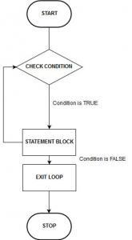

# If Statements, Loops, Custom Functions
If statements and loops help implement logical operations in any programming language. We'll learn how to write these operations in R through basic examples.
A function groups operations into a single line of code which can be used repeatedly with different inputs.

1.  **If Statements**
    - An if statement in R has the following syntax:
    
      ```
      if (<condition>) {
        <statement1>
      }
      ```
      
 
    - If the condition is True, then `statement1` is executed. If the condition is False, `statement1` is ignored and nothing happens. Try running this block of code which will print out a message if x is smaller than 10:
      ```
      x <- 5
      if (x < 10) {
        print("x is smaller than 10!")
      }
      ```
    - In this case, we can extend this statement to include an `else` clause to execute another statement if the condition `x < 5` is False.
      ```
      x <- 10
      if (x < 5) {
        print("x is smaller than 10!")
      } else {
        print("x is larger than or equal to 10!")
      }
      ```
      <!-- this image address doesn't work anymore-->

    - How about checking more conditions? Use `else if`! Any guesses which message the code will print out?
      ```
      x <- 12
      if (x < 5) {
        print("small x")
      } else if (x < 10) {
        print("medium x")
      } else if (x < 15) {
        print("large x")
      } else {
        print("very large x")
      }
      ```
      <!--this image address doesn't work anymore-->
 

2.  **Loops**
      - A for loop runs some specific lines of code for a number of times.<br>
       

        `c(1:3)` is a vector containing integers `[1,2,3]`. The loop below will execute `statement` for a total of 3 times, one time each for i=1, 2, 3.
        ```
        for (i in c(1:3)) {
          <statement1>
        }
        ```
      - From Activity 3, we have a `score` variable containing test scores of 8 students. Suppose that we want to add 20 more points for each student. This can be achieved efficiently with a for loop. 
        `length(score)` calculates the length of vector `score` which is the number of times we need to iterate through the loop (8 times).
        `i` serves as an index and is a variable that is local/valid to only this for loop. We can also use `i` within the loop.
        ```
        # score <- c(70, 62, 67, 69, 90, 72, 75, 80)
        lenscore <- length(score)
        for (i in c(1:lenscore) {
          score[i] <- score[i] + 20
        }
        score
        ```
      - *Exercise*: how would you change the above code to add 20 points for only the first 3 scores and add 10 points for the last 5 scores? Hint: you may need one loop for the first 3 scores and another loop for the last 5.

3.  **Custom Functions**
      - We've used many functions built into R and from installed packages but what if there is no off-the-shelf function that does exactly what we want or deals with our specific dataset? Let's take matters in our own hands and build a function ourselves!
      - Defining a function in R follows the syntax:
        ```
        function_name <- function(input1, input2, ...) {
           <statement1>
           <statement2>
           do something with the inputs
           return <result>
        }
        ```
      - A function usually takes in a number of inputs (also called arguments), performs some operations with the inputs, and return a result. Take a look at this function `addScore` that does the same thing as the for loop we saw previously.
        ```
        addScore <- function(score) {
            lenscore <- length(score)
            for (i in c(1:lenscore)) {
                score[i] <- score[i] + 20
            }
            return(score)
        }
        ```
      - Running the lines above in R doesn't do anything yet other than defining the function. To run the function on the data `score`:
        ```
        addScore(score)
        ```
      - *Exercise*: Fancy adding an if statement to it? Try modifing the `addScore` function to also print out a warning when someone's new score is above 100 and if that happens, assign the score to the maximum value of 100. Feel free to ask the instructor for help!

[NEXT STEP: Interactive Data Dashboard With RShiny](act-5.html){: .btn .btn-blue }
