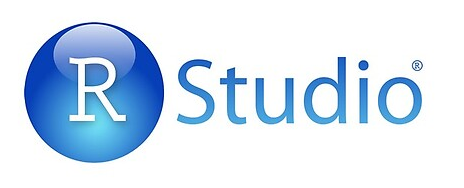

# RStudio Intermediate Data Analysis

- Pre-workshop activities: 15 min 
- Introductory presentation: 15 min
- Hands-on activities: 50 min

## Why RStudio? 

"[RStudio](https://www.rstudio.com/products/rstudio/download/){:target="_blank"} is a free, open source software program for statistical analysis. Its interface is organized so that the you can clearly view graphs, data tables, R code, and output all at the same time. It also offers an Import-Wizard-like feature that allows users to import CSV, Excel, SPSS, and other file types into RStudio without having to write the code to do so." - [Kent State University Libraries](https://libguides.library.kent.edu/statconsulting/r){:target="_blank"}

**Who is this workshop for?**: Users who are familiar with basic statistical concepts and basic R, covered in the [Introduction to Data Analysis with RStudio](https://lib.uvic.ca/rstud){:target="_blank"} workshop. Please note, this workshop does not cover statistical concepts in depth, and it is mostly focused on how to use R and RStudio to implement statistical analysis.

## Learning objectives

At the end of this workshop, you will be able to:

1.  Generate reports in .pdf, .docx, .html formats with RMarkdown
2.  Use R to test for difference in means with t-tests and ANOVA
3.  Use R to construct and assess linear regression models
4.  Use if and for loops and create custom functions in R

[NEXT STEP: Pre-Workshop Activities](pre-workshop.html){: .btn .btn-blue }
